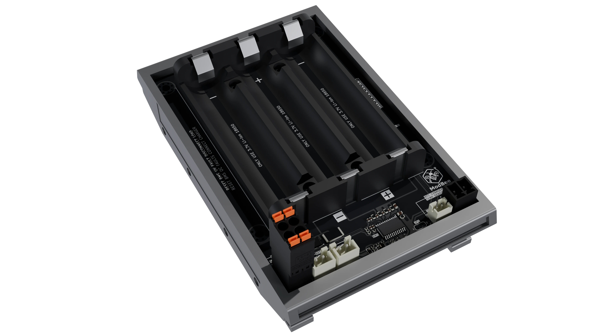

# ModBee Battery Pack 18650

**Protected 3S Li-ion battery pack with TI BQ77915**

## Overview

The ModBee Battery Pack 18650 is a compact, protected **3S** (3 cells in series) lithium-ion battery pack utilizing standard **18650** cells. It features the **Texas Instruments BQ7791501PWR** primary protector IC for ultra-low power operation, autonomous cell balancing, and comprehensive voltage, current, and temperature protections. This design is optimized for portable devices, solar charging systems, or applications requiring reliable battery management without a microcontroller.

## Key Features

- **Cell Configuration** — 3-series (3S) Li-ion cells (supports 3-5S natively, configured for 3S)
- **Protector IC** — TI **BQ7791501PWR** (ultra-low power primary protector with stackable interface)
- **Protections** (from TI BQ77915 datasheet, Rev. L):
  - **Overvoltage (OV)** per cell — 4.2 V typical (configurable 3.0–4.575 V, ±10 mV accuracy)
  - **Undervoltage (UV)** per cell — 2.7 V typical (configurable 1.2–3.0 V, ±18 mV accuracy)
  - **Overcurrent in Charge (OCC)** — 15 A (programmable via resistor)
  - **Overcurrent in Discharge (OCD)** — 20 A / 10 A (dual threshold, programmable)
  - **Short Circuit in Discharge (SCD)** — 50 A (–40 to –340 mV configurable)
  - Automatic recovery — attach charger after fault
- **Cell Balancing** — Autonomous passive balancing with integrated FETs (up to 50 mA per cell); supports external FETs for higher currents
- **Temperature Protection** — External NTC thermistor (10 kΩ at 25°C, negative temperature coefficient, 103AT type)
  - Dedicated "BATT TEMP" section for solar charger integration
  - Overtemperature Charge (OTC): 45°C or 50°C (selectable)
  - Overtemperature Discharge (OTD): 65°C or 70°C (selectable)
  - Undertemperature Charge/Discharge: ~0°C / ~-20°C
- **Current Sensing** — Low-side 1 mΩ sense resistor
- **Power Consumption** — 8 µA typical in NORMAL mode; 2 µA in HIBERNATE mode; 0.5 µA max in SHUTDOWN
- **FET Control** — Independent low-side N-channel MOSFET drivers for charge (CHG) and discharge (DSG)
- **Connectors** — XH JST-style for PACK+/PACK-, charger/load connections
- **No MCU Required** — Factory-programmed thresholds; standalone operation
- **Stackable Design** — Supports scaling from 1 pack to multiple via daisy-chain connection. Multiple boards can be stacked using physical standoffs for increased cell count while maintaining independent protection per stack level ( make sure all packs are the same voltage before stacking ).

## Specifications

| Parameter | Value | Notes |
|-----------|-------|-------|
| **Nominal Voltage** | 11.1 V | 3 × 3.7 V per cell |
| **Fully Charged Voltage** | 12.6 V | 3 × 4.2 V per cell |
| **Cutoff Voltage (UV)** | ~8.1 V | 3 × 2.7 V per cell (configurable) |
| **Max Continuous Discharge** | 20 A | Protected by OCD/SCD limits |
| **Max Charge Current** | 15 A | Protected by OCC limit |
| **Short-Circuit Current Limit** | 50 A | Threshold configurable –40 to –340 mV |
| **Cell Balancing Current** | Up to 50 mA per cell | Internal FETs; external FETs optional for higher current |
| **Sense Resistor** | 1 mΩ low-side | Low-impedance, precise current sensing |
| **Quiescent Current (Normal)** | 8 µA typical | NORMAL operation mode |
| **Quiescent Current (Hibernate)** | 2 µA | Ultra-low power storage mode |
| **Quiescent Current (Shutdown)** | 0.5 µA max | Minimum power consumption at rest |
| **Operating Temperature Range** | –40°C to +85°C | Per IC specifications |
| **NTC Configuration** | 10 kΩ @ 25°C, Type 103AT | Pull-up resistor and RC filtering included |
| **OV Accuracy** | ±10 mV | Per cell overvoltage threshold |
| **UV Accuracy** | ±18 mV | Per cell undervoltage threshold |
| **Stackability** | 3S to 20S+ | Daisy-chain stacking via dedicated pins; use M3/M4 standoffs |

## Usage Instructions

### Cell Selection (CRITICAL for Safety)
**⚠️ All three 18650 cells MUST be identical in the following specifications:**
- **Exact Capacity** — All cells must have the same rated mAh (e.g., 3000 mAh ±5%)
- **Exact Voltage** — All cells must have the same nominal voltage (3.7 V)
- **Brand & Chemistry** — Use the same brand and LiPo/Li-ion chemistry; do **NOT** mix brands or types
- **Age & Condition** — Cells should be from the same batch/manufacturing date if possible

**Reason:** Mixing cells with different capacities or voltages causes:
- Uneven balancing, reducing pack lifespan
- Risk of individual cell overcharge/overdischarge
- Potential safety hazard including cell damage or thermal runaway

### Installation & Assembly
1. **Cell Installation** — Install three matched 18650 cells (identical capacity, voltage, brand) with correct polarity.
2. **Thermistor** — Ensure NTC is in thermal contact with cells for accurate temperature protection.
3. **Physical Stacking** — If building multi-stack configurations (>3S), mechanically stack boards using **M3 standoffs** (25-30 mm height) to maintain separation and allow proper airflow between stacks. Daisy-chain the stackable interface plugs.
4. **Charging** — Use a 12.6 V CC/CV Li-ion charger (≤15 A). Connect to charger terminals. Pack recovers automatically on charger attachment after faults.
5. **Discharging** — Connect load to PACK+ / PACK- (observe polarity).
6. **Fault Recovery** — For OV/UV/OC/SC faults, attach charger or remove load as needed.
7. **HIBERNATE Mode** — For storage, float PRES pin to enter ultra-low power mode (~2 µA).

## Safety Warnings

- **⚠️ CRITICAL: Cell Matching is Mandatory** — Use ONLY high-quality, matched 18650 Li-ion cells with **identical capacity, voltage, brand, and age**. Mixing cells with different specifications can cause:
  - Improper cell balancing leading to premature failure
  - Individual cell overcharge/overdischarge
  - Thermal runaway or cell rupture
  - Complete pack failure

- **Do Not Mix Cell Types** — Never mix different brands, chemistries (LiPo vs. Li-ion), or cells from different batches.
- **Never bypass protection circuitry** — Protection is mandatory for safe operation.
- **Avoid shorts, reverse polarity, or exposure to extremes** — Check polarity before assembly.
- **Charge in a fire-safe area** — Monitor during high-current operation (≥10 A). Faulty cells can vent flames.
- **Inspect regularly** — Check for physical damage, swelling, or leakage. Do not use damaged cells.
- **Lithium batteries are hazardous if mishandled** — Treat as hazardous material during transport and storage per regulations.
- **Dispose responsibly** — Recycle used cells through a certified recycling facility; do not dispose in household waste.

## References

- **TI BQ77915 Datasheet** (Rev. L) — [https://www.ti.com/lit/gpn/bq77915](https://www.ti.com/lit/gpn/bq77915) — Primary reference for all protection thresholds, specifications

- **Schematic File** — [modbee-battery-pack-18650.pdf](./schematics/modbee-battery-pack-18650.pdf) — Board design and component placement

